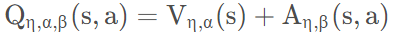

​	The algorithm used in this experiment is DQN, a deep neural network algorithm. It is an excellent algorithm, but it still has some shortcomings. We have implemented two algorithms in the experiment: `Double DQN` and `Dueling DQN`, which can improve the effect of DQN to some extent.

**Double DQN**

​	Both DQN of deep reinforcement learning and traditional Q learning have maximization bias, which will overestimate Q value. Overestimation means that the estimated value function is larger than the real value function. If the overestimation is uniform in all states, the maximum action of the value function can still be found according to the greedy strategy, but the overestimation is often not uniform in all states. Therefore, the overestimation will affect the policy decision and lead to the acquisition of the non-optimal strategy.

​	Overestimation occurs because of the max operation used during parameter update or value function iteration. DDQN is used to solve the problem of overestimation. The core idea is that the action selection of TD target and the action evaluation of TD target are realized by different value functions.

​	This is the updated formula of DQN objective function:


​	DDQN is the selection and evaluation of actions with different value functions. The updated formula is shown below:


​	The difference between the two target functions is that the optimal action selection in Double-DQN is based on the parameters of the Q network that is currently being updated, while the optimal action selection in DQN is based on the parameters of the previous Q network.

​	The function `learn`  of DDQN is as follows:

```
    def learn(self, memory: ReplayMemory, batch_size: int) -> float:
        state_batch, action_batch, reward_batch, next_batch, done_batch = memory.sample(batch_size)
        values = self.__policy(state_batch.float()).gather(1, action_batch)
        max_action = self.__policy(next_batch.float()).max(1)[1]
        values_next = self.__target(next_batch.float()).gather(1, max_action.unsqueeze(1)).squeeze(1)
        expected = (self.__gamma * values_next.unsqueeze(1)) * (1. - done_batch) + reward_batch
        loss = F.smooth_l1_loss(values, expected)
        self.__optimizer.zero_grad()
        loss.backward()
        for param in self.__policy.parameters():
            param.grad.data.clamp_(-1, 1)
        self.__optimizer.step()
        return loss.item()
```

​	The objective function is calculated as follows:

```
	max_action = self.__policy(next_batch.float()).max(1)[1]
	values_next = self.__target(next_batch.float()).gather(1, max_action.unsqueeze(1)).squeeze(1)
```

​	The target value is calculated through the target-q network. In DQN, the action with the largest Q value is originally selected according to the parameter of target-q. However, after the selection is changed by DDQN, the calculated Q value must be less than or equal to the original Q value, so when calculating the target value, it will be smaller than the original. This reduces the overestimation to some extent, making the Q value closer to the true value.


**Dueling DQN**

​	In some situations, the agent only pays attention to the value of the state and does not care about the difference caused by different actions. In this case, modeling the two separately can enable the agent to better deal with the state less associated with the action. When estimating Q(s, a), we can do a decomposition:



​	Where, V(s) is state value, which is related to state and independent of action; A(s, a) is an advantage function that measures how good each action is relative to other actions. In the policy gradient, this method can reduce the variance of error during learning and make learning more stable. Thus, Dueling DQN is produced.

​	The above formula has the problem of not unique modeling for V and A values. For example, for the same Q value, if you add a constant to the value of V and subtract this constant from all the values of A, the resulting Q value will remain the same, which leads to instability in the training. To solve this problem, the actual output of the advantage function of Dueling DQN forcing the optimal action is 0:


​	This ensures the uniqueness of V value modeling. In the implementation, we can also use average instead of maximization:


​	It's actually better and more stable to put the maximized form into the mean form.

​	The class `DQN`  of Dueling DQN is as follows:

```
    def __init__(self, action_dim, device):
        super(DQN, self).__init__()
        self.__conv1 = nn.Conv2d(4, 32, kernel_size=8, stride=4, bias=False)
        self.__conv2 = nn.Conv2d(32, 64, kernel_size=4, stride=2, bias=False)
        self.__conv3 = nn.Conv2d(64, 64, kernel_size=3, stride=1, bias=False)
        self.__fc1 = nn.Linear(64*7*7, 512)
        self.__fcA = nn.Linear(512, action_dim)
        self.__fcV = nn.Linear(512, 1)
        self.__device = device
    def forward(self, x):
        x = x / 255.
        x = F.relu(self.__conv1(x))
        x = F.relu(self.__conv2(x))
        x = F.relu(self.__conv3(x))
        x = F.relu(self.__fc1(x.view(x.size(0), -1)))
        A = self.__fcA(x)
        V = self.__fcV(x)
        return V + A - A.mean(1).view(-1,1)
```

​	The state value function and advantage function are as follows:

```
        self.__fcA = nn.Linear(512, action_dim)
        self.__fcV = nn.Linear(512, 1)
```

​	Q value is calculated as follows:

```
		return V + A - A.mean(1).view(-1,1)
```

​	Dueling DQN can learn state value function more efficiently. With each update, the function V is updated, which also affects the Q values of other actions. The traditional DQN will only update the Q value of one action, and the Q value of other actions will not be updated. Therefore, Dueling DQN can learn the state value function more frequently and accurately.
